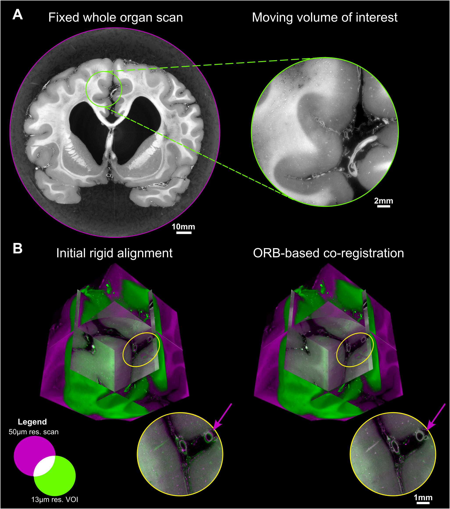

# hipct-landmark-coregistration
HiP-CT multi-scale co-registration based on automated feature matching.

This repository contains the 2.5D/3D affine co-registration of multi-scale HiP-CT data based on oriented Features from Accelerated Segment Test (FAST), a corner/edge detection algorithm across scales, and then rotated Binary Robust Independent Elementary Features (BRIEF), to generate compact binary scale/rotation-robust descriptors known as Oriented FAST and Rotated BRIEF (ORB) features. The function interacts directly with HiP-CT data through hoa-tools and assess the co-registration using SimpleITK.

This work is largerly based on contributions and Python packages developed by others and reported previously, mainly:
* `opencv-python` (OpenCV, Open Source Computer Vision Library)
* `SimpleITK` (Lowekamp et al. The Design of SimpleITK. Frontiers in Neuroinformatics. 2013 Dec 30;7:45)
* `hoa-tools` (Human Organ Atlas Python Tools)

